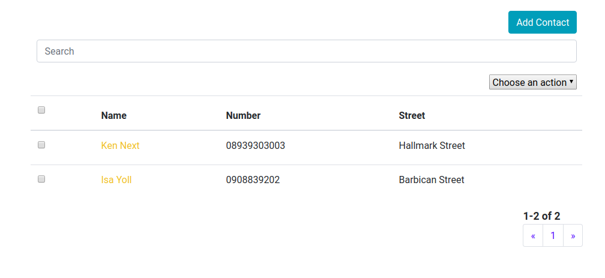
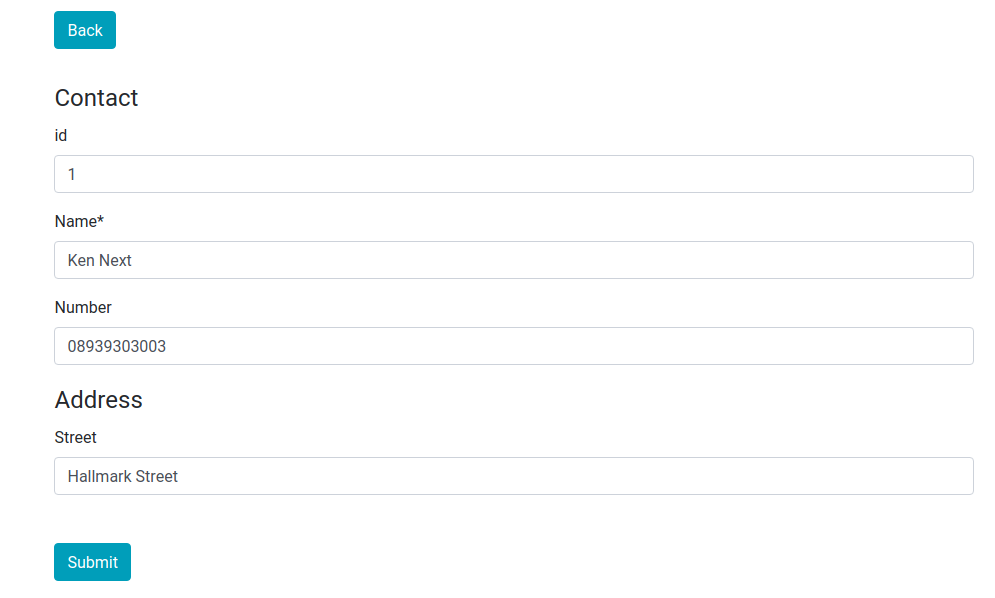
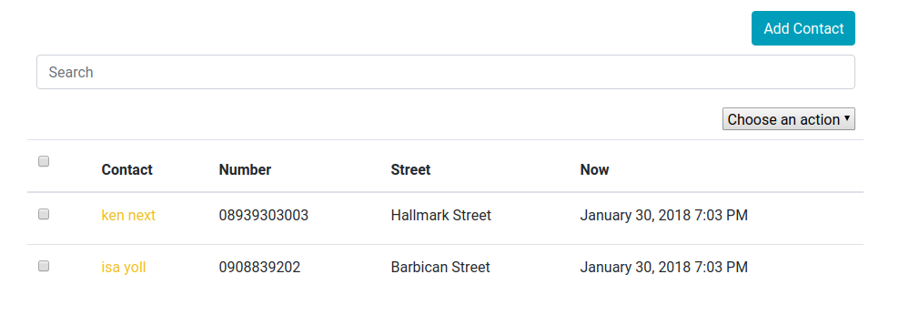

# react-crud-admin

**react-crud-admin** is inspired by the Django Admin Interface. In the spirit of Django admin it opts for component customization by inheritance. The create-read-update-delete pattern is something that is encountered in a lot of apps. By creating a single component that lists entries and allows adding/changing it becomes possible to implement a DRY approach.

Since React is primarily a UI library and there are a litany of backends, **react-crud-admin** does not implement any backend specific features but allows the developer to provide custom implementations.

# Getting Started

## Installation

Install the library,

    npm install react-crud-admin

## Example

If you are starting a react project you can use **create-react-app** to speed up bootstrapping,

    npm install create-react-app
    npx create-react-app example
    cd example

then within the `example` directory,

    npm install react-crud-admin

Create a new file `example.js` in the `\src` folder, in that file add the following lines

```javascript
import React from "react";
import Admin from "react-crud-admin";
import "react-crud-admin/css"; //optional css import

export default class Example extends Admin {
  constructor() {
    super();
    this.name = "Contact"; // name of the objects
    this.name_plural = "Contacts"; // name of the objects in plural
    this.list_display_links = ["name"]; // which property of the object is clickable
    this.list_display = ["name", "number", "address.street"]; // a list of properties of the object to displayed on the list display page
  }
  get_queryset(page_number, list_per_page, queryset) {
    // the actual array containing objects to be displayed
    return [
      {
        id: 1,
        name: "Joe Next",
        number: "08939303003",
        address: { street: "Hallmark Street" }
      },
      {
        id: 2,
        name: "Isa Yoll",
        number: "0908839202",
        address: { street: "Barbican Street" }
      }
    ];
  }
}
```

then in `index.js` do

```javascript
import React from "react";
import ReactDOM from "react-dom";
import Example from "./example.js";

ReactDOM.render(<Example />, document.getElementById("root"));
```

The output in your browser should be



This is the list display view. At this point adding and editing objects will not be possible since we have not configured the add/change view. To do that we need to import the `react-jsonschema-form` package.

Edit `example.js` and add the following,

```javascript
import React from "react";
import Admin from "react-crud-admin";
import Form from "react-jsonschema-form";
import "react-crud-admin/css"; //optional css import

export default class Example extends Admin {
  constructor() {
    super();
    this.name = "Contact";
    this.name_plural = "Contacts";
    this.list_display_links = ["name"];
    this.list_display = ["name", "number", "address.street"];
  }
  get_queryset(page_number, list_per_page, queryset) {
    return [
      {
        id: 1,
        name: "Ken Next",
        number: "08939303003",
        address: { street: "Hallmark Street" }
      },
      {
        id: 2,
        name: "Isa Yoll",
        number: "0908839202",
        address: { street: "Barbican Street" }
      }
    ];
  }
  get_form(object = null) {
    let schema = {
      title: this.name,
      type: "object",
      required: ["name"],
      properties: {
        id: {
          type: "number",
          title: "id",
          default: Math.floor(1000 * Math.random()) + 1
        },
        name: { type: "string", title: "Name", default: "" },
        number: { type: "string", title: "Number", default: "" },
        address: {
          type: "object",
          title: "Address",
          properties: {
            street: { type: "string", title: "Street" }
          }
        }
      }
    };

    if (!object) {
      return <Form schema={schema} />;
    } else {
      return <Form schema={schema} formData={object} />;
    }
  }
}
```

the `get_form` method is passed the current object. The method returns a `react-json-schema` `Form` component. The `schema` object is used to define a `schema` for the Form (and to provide validation). See more on `react-jsonschema-form` at [react-jsonschema-form](https://github.com/mozilla-services/react-jsonschema-form). You can also read more on JSON Schema at [JSON Schema Tutorial](https://spacetelescope.github.io/understanding-json-schema/)

In `get_form` we check if an object exists displaying a preloaded form if it does and an empty one if it does not.

The output in your browser after clicking the Add Contact button should be


The output in your browser after clicking the first contact's name should be



# Guide

## List Display View

### Data

Data is primarily injected through `get_queryset`.

```javascript
get_queryset(page_number, list_per_page, queryset);
{
  return [
    {
      id: 1,
      name: "Ken Next",
      number: "08939303003",
      address: { street: "Hallmark Street" }
    },
    {
      id: 2,
      name: "Isa Yoll",
      number: "0908839202",
      address: { street: "Barbican Street" }
    }
  ];
}
```

The `get_queryset` method returns the queryset array including objects to be displayed in the current display page. Returning an array may not be useful when asynchronous network calls are made to a remote backend using AJAX or `window.fetch`. A class method of the `Admin` component `set_queryset` can be used for asynchronous calls.

The example below returns the queryset in the current state object synchronously and sets a new queryset when the asynchronous call returns successfully. `set_queryset` invokes `setState` internally.

```javascript
get_queryset(page_number, list_per_page, queryset);
{
  fetch("/path/to/backend", { method: "get" }).then(response => {
    if (response.ok) {
      this.set_queryset(response.results);
    }
  });
  return queryset;
}
```

It is important to note that `get_queryset` returns only items to be listed in the current display view/page. It is necessary to use the arguments `page_number` and `list_per_page` for fetching data from the backend. This allows us to implement pagination.

```javascript
get_queryset(page_number, list_per_page, queryset);
{
  let backend = "/path/to/backend";
  let path =
    backend +
    "&limit=" +
    list_per_page +
    "&skip=" +
    (page_number - 1) * list_per_page;
  fetch(path, { method: "get" }).then(response => {
    if (response.ok) {
      response.json().then(results => {
        this.set_queryset(results.data);
        this.set_total(results.total);
      });
    }
  });

  return queryset;
}
```

`set_total` is used to set the total number of items available. For example if `list_per_page` is 10
and there are a total 100 records in the backend `results.data` will have 10 items and `results.total` is 10. Please note that it is the responsibility of the backend to return these values in whatever format.

`set_queryset` is just,

```javascript
set_queryset(queryset);
{
  this.setState({ queryset: queryset });
}
```

and `set_total` is ,

```javascript
set_total(total);
{
  this.setState({ total: total });
}
```

It is also possible to set a fixed queryset using `queryset` property.

```javascript
this.queryset = [
  {
    id: 1,
    name: "Ken Next",
    number: "08939303003",
    address: { street: "Hallmark Street" }
  },
  {
    id: 2,
    name: "Isa Yoll",
    number: "0908839202",
    address: { street: "Barbican Street" }
  }
];
```

This is always overriden by `get_queryset`.

### UI Customisation

#### Display

##### List Display

The `get_list_display` method returns a list/array of properties/field names of the objects in the queryset to be displayed on the list display page. It can be overridden by the member variable
list*display. A property is any string that should exist in the objects within
a queryset and works with lodash's *.at function. See more at [Lodash](https://lodash.com/docs/#at)

```javascript
let object={ name : "any name",{ address : { street : "any"}},emails: ["any@any.com"]}
```

The properties "name","address.street" and "emails[0]" are all acceptable. In our example we use,

```javascript
this.list_display = ["name", "number", "address.street"];
```

We can also use,

```javascript
get_list_display()
{
  return ["name", "number", "address.street"];
}
```

##### List Display Links

The `get_list_display_links` method returns the list/array of properties of the objects in the queryset that are clickable (and redirect to the add/change view) when displayed on the list display page. It can be overridden by the member variable
`list_display_links`. A property is any string that should exist as a property in the objects within
a queryset and works with lodash's `_.at` function.

In our example we use,

```javascript
this.list_display_links = ["name"];
```

in the constructor but we could have used,

```javascript
get_list_display_links(){

      return ['name']

}
```

#### Header Transforms

Table headers in the list display view are obtained from property names in `get_list_display` method by default. There are certain cases when one would like to customise these headers. `get_header_transforms` does just that. As an example

```javascript
get_header_transforms()
{
  return {
    name: function(header) {
      return "Contact " + header;
    }
  };
}
```

Should produce


Header transforms can be defined using the instance variable `header_transforms` (which is always overridden by `get_header_transforms`).

```javascript
this.header_transforms = {
  name: function(header) {
    return "Contact " + header;
  }
};
```

In summary `get_header_transforms` returns an object whose properties are field names corresponding to properties of any object in the queryset and whose values are transform functions.

#### Field Transforms

Field transforms return an object whose properties are field names corresponding to properties of any object in the queryset and whose values are transform functions. They are used to transform the values of objects within the queryset. For example to transform every "name" property of all the objects in the queryset to lower case we use,

```javascript
get_field_transforms()
{
  return {
    name: function(content, object) {
      return content.toLowerCase();
    }
  };
}
```

or

```javascript
this.field_transforms = {
  name: function(content, object) {
    return content.toLowerCase();
  }
};
```

The first argument of the transform function is the content to be displayed while the second argument is the current object.

This produces


All the contact names have been turned to lower case. Field transforms apply to full columns on the data table in the display view. It is possible to replace fields with React components like images and buttons. As an example suppose a column has fields which contain image urls, we can replace each field with a corresponding image.

```javascript
this.field_transforms = {
  image_url: function(content, object) {
    return ;
  }
};
```

#### Extra Fields

It is sometimes desirable to create new fields that are not properties of any of the objects in the queryset. As an example, we create a new field that displays the current time using the `moment` library.

```javascript
get_extra_fields()
{
  return {
    now: function(object, label) {
      return moment(new Date()).format("LLL");
    }
  };
}
```

or somewhere in the constructor,

```javascript
this.extra_fields = {
  now: function(object, label) {
    return moment(new Date()).format("LLL");
  }
};
```

The `get_extra_fields` method returns an object whose properties are extra field names not corresponding to properties of any object in the queryset and whose values are display functions. This will create extra fields that are not tied to objects. Extra fields have to be manually included in the `get_list_display` in order to appear in the list display page.

Adding the `get_extra_fields` method is not enough to display the newly created field. We must add the field to `list_display` .

```javascript
this.list_display = ["name", "number", "address.street", "now"];
```

Don't forget to add `import moment from "moment";` at the top of the file. The output is,



#### Pagination

`get_list_per_page` method returns the number of items to be listed in a page. Can be overridden by `list_per_page`.

```javascript
this.list_per_page = 10;
```

or

```javascript
get_list_per_page()
{
  return 10;
}
```

#### Search

Search is not implemented by default. One has to implement the `search(term,queryset)` method.
From our previous example, we can implement search by matching the search term with the "name" property of all objects in the queryset. The method returns a filtered queryset. Optionally, if search requires an asynchronous call to a backend, one can use `set_queryset`.

```javascript
search(term, queryset);
{
  let filtered_queryset = [];
  for (var object of queryset) {
    if (object.name.search(new RegExp(term, "i")) >= 0) {
      filtered_queryset.push(object);
    }
  }
  return filtered_queryset;
}
```

or asynchronously

```javascript
search(term, queryset);
{
  fetch("/path/to/backend/search?q=" + term, { method: "get" }).then(
    response => {
      if (response.ok) {
        this.set_queryset(response.results);
      }
    }
  );
  return queryset; //remember to return queryset synchronously
}
```

We can enable live search by

```javascript
this.live_search = true;
```

default is `false`.

#### Sorting

Sorting is not implemented by default. Sorting can be achieved by implementing the `sort_by` method,

```javascript
sort_by(sort_fields, queryset);
{
}
```

`sort_fields` is an array containing objects whose properties are properties of objects in the queryset and whose values are either "asc" or "desc". As an example, for a queryset

```javascript
[
  {
    id: 1,
    name: "Joe Next",
    number: "08939303003",
    address: { street: "Hallmark Street" }
  },
  {
    id: 2,
    name: "Isa Yoll",
    number: "0908839202",
    address: { street: "Barbican Street" }
  }
];
```

we can have `sort_fields` equal to

```javascript
[{ name: "asc" }, { number: "desc" }, { address: "asc" }];
```

For our example, we implement `sort_by` using,

```javascript
sort_by(sort_fields, queryset); //from adminjs
{
  let item = sort_fields[sort_fields.length - 1];

  let pairs = _.toPairs(item);
  let field_names = pairs.map(item => item[0]);
  let field_orders = pairs.map(item => item[1]);

  return _.orderBy(queryset, field_names, field_orders);
}
```

We use the `lodash` library to sort the current queryset and return an updated one. We only use the latest sort order by examining the last item of the `sort_fields` array. In a practical application,
a backend will perform the sort operations and we will use `set_queryset`.

```javascript
    sort_by(sort_fields,queryset)
    {
	fetch('/path/to/backend/sort',{
	     'method': 'post',
	     'body': JSON.stringify(sort_fields)}).then((response)
	     {
	         if(response.ok}
	          {
			response.json().then((results)=>
			{

			this.set_queryset(results.data);

			})

                   }
	     })

      return  queryset;
    }
```

It is also important to define the member variable `is_object_equal` which defines equality between objects in a queryset. This variable is used to test if an object has been previously selected using the radio buttons in the display view. By default,`is_object_equal` is

```javascript
this.is_object_equal = function(a, b) {
  return a == b;
};
```

This may not be sufficient for some applications. For example we might want to use the object's `id` property to check equality.

Sorting can achieved in the list display view by clicking on the table headers corresponding to property names.

```javascript
this.is_object_equal = function(a, b) {
  return a.id == b.id;
};
```

#### Actions

`get_actions` returns an actions object whose properties are action names and values are action methods. `get_actions` can be overridden by the `actions` member variable.

Each actions object property (e.g. "delete") is passed an array of selected objects. One
can then handle those objects. Actions will appear on the list display page within a
dropdown. The default "delete" action method is not implemented.

We can implement the delete action for our previous example,

```javascript
import React from 'react';
import Admin from "react-crud-admin";
import Form from "react-jsonschema-form";
import moment from "moment";
import "react-crud-admin/css";//optional css import

var data=[
	    {id: 1, name: 'Ken Next', number: '08939303003',address:{ street: "Hallmark Street"}},
            {id: 2,name: 'Isa Yoll', number: '0908839202',address:{ street: "Barbican Street"}}
];
export default class Example extends Admin
{
	......
	......
	......
	get_queryset()
	{
		return data
        }

	get_actions()
		{
   	     	return { "delete" : (selected_objects)=>{
   	       	                   let total=data.length;
                                   for(let object of selected_objects)
   				    {
      				       data.splice(data.indexOf(object),1);

                                   }
				   this.set_queryset(data);
				   this.set_total(total-selected_objects.length);
			  }
		  }

	}

}
```

#### Filters

`get_filters` can be used to implement filters for the queryset.

```javascript
get_filters()
{
  return {
    by_street_name: {
      options: [
        { value: "Hallmark Street", label: "Hallmark Street" },
        { value: "Barbican Street", label: "Barbican Street" }
      ],
      filter_function: (option, queryset) => {
        let grouped = _.groupBy(queryset, "address.street");

        return _.has(grouped, option.value) ? grouped[option.value] : [];
      }
    },
    by_id: {
      options: [
        { value: "even", label: "even" },
        { value: "odd", label: "odd" }
      ],
      filter_function: (option, queryset) => {
        let grouped = _.groupBy(queryset, contact => {
          return contact.id % 2 == 0 ? "even" : "odd";
        });

        return _.has(grouped, option.value) ? grouped[option.value] : [];
      }
    }
  };
}
```

The `get_filters` method returns an object whose properties are filter names. The example above returns 2 filters. The first is a filter `"by_street_names"` that filters based on the street addresses of the contacts. Each filter object has two properties : `"options"` and `"filter_function"`. `"options"` is an array of options objects which have a `"value"` and `"label"` properties. The `"label"` will appear in the UI while the `"value"` is used for processing. This is similar to the `select` HTML tag. For asynchronous operations, a method to set the options of a filter is provided. `set_filter_options` takes two arguments,

```javascript
set_filter_options(filter_name, options);
```

the name of the filter and the options array of the filter.

The `"filter_function"` is a function that performs filtering. It has two arguments, `"option"` which is the selected `"option"` and the current queryset. It must return a queryset. `"option"` is one of `"options"` array. For asynchronous cases, `set_queryset` and `set_total` methods can be used to set the queryset after backend filtering.

The second filter `"by_id"` filters the queryset by even and odd `id` property. The filter UI uses [React Select](https://github.com/JedWatson/react-select) component.

## Add/Change View

Starting from version 1.0.48 the add/change view is presented in a modal. 

### Forms

We can add submit handlers for the form in our example,

```javascript
....
....
....
export default class Example extends Admin
{

.....
.....
.....

 get_form(object=null)
    {
    	let schema = {
	    title: this.name,
	    type: "object",
	    required: ["name"],
	    properties: {
		id: {type: "number", title: "id", default: Math.floor(1000*Math.random())+1 },
		name: {type: "string", title: "Name", default: ""},
		number : {type: "string", title: "Number", default: ""},
		address : {type: "object", title: "Address",
		       properties : {
		              street : { type : "string",title : "Street"}
		        }
		    }
	    	 }
	    };

	 if(!object)
	 {
		   return <Form schema={schema} onSubmit={this.form_submit.bind(this)} />
	 }
	 else
	 {
	        return <Form schema={schema}  formData={object} onSubmit={this.form_submit.bind(this)} />
	 }
     }
....
....
....
    form_submit(form)
    {
	let contact=form.formData;

	if(form.edit)
	{

	    this.state.queryset.splice(this.state.queryset.indexOf(this.state.object),1,contact);
	    this.response_change();
	}
	else
	{
	    this.state.queryset.push(contact);
	    this.response_add();
	}
    }

......
......
......
}
```

The submit handler checks to see if an object is being edited and replaces it with the edited object. If the object is being added, the method appends it to the `state.queryset` object.

#### Post Submit

`response_add` or `response_change` can be called after a new object is created or edited respectively. These functions should implement behaviour after a successful form submission. By default these functions are both defined as,

```javascript
function()
{
  this.setState({display_type :display_type.list,
                 object :null,
                 queryset: this.get_queryset(this.state.page_number,this.list_per_page,this.state.queryset)
	       });
}
```

This sets the display type to "list", changes the object to `null` and invokes `get_queryset` to fetch the latest data.

## Permissions

`has_add_permission` , `has_change_permission` and `has_module_permission` methods are used to control access.

The `has_add_permission` method takes no arguments and should return a boolean that signifies wether the user can add a new object. It simply hides the Add button.

The `has_change_permission` method takes the current object being edited, `state.object`, as an argument and should return a boolean that signifies wether the user can edit an object. It simply disables all `list_display_links`.

The `has_module_permission` method takes no arguments and should return a boolean that signifies wether the user should load the component. It simply shows an error message after an unauthorized access attempt.

## Miscellany

### `state` object

The default `state` object has the following properties,

| Property           | Default Value | Description                                                        |
| ------------------ | ------------- | ------------------------------------------------------------------ |
| `queryset`         | `[]`          | Can be set with `set_queryset`                                     |
| `page_number`      | `1`           |
| `total`            | `0`           | Total number of items. Can be set with `set_total`.                |
| `display_type`     | `"list"`      | Current display. Can be `"list"` or `"change"` for add/change view |
| `object`           | `null`        | Current object to be edited (or created) in the add/change view    |
| `selected_objects` | Empty set     | The `Set` class a wrapper around `array` that implements set logic |

Care must be taken note to override the state object values especially at initialization stages e.g. in the constructor or `component_will_mount`. It is always necessary to call `super()` as the first statement in the constructor. 

### Progress Indicator

`show_progress` and `hide_progress` can be used in the both the list display and add/change view to display and hide a progress indicator. `render_progress` can be used to override the default progress indicator component to be rendered. `render_progress` has one argument which is a boolean denoting whether or not to render a progress indicator. For example,

```javascript
render_progress(loading);
{
  if (loading) {
    return <progress />;
  }
}
```

`render_progress` should return a component.

### ESDOC API Documentation.

The API documentation generated with `esdoc.js` is available [here](https://mjibril.github.io/react-crud-admin/).

## Component Props

There are many instances where customising the `react-crud-admin` component using component props is beneficial. Perhaps the component is to be used as a child component that reacts to changes in the parent component. For those cases it is possible to use props to customise the `Admin` component.

All members and properties of the `Admin` component class can be assigned using React component props. All functions passed as props are automatically bound to the `Admin` thus making them class members. This means that `this` will reference the `Admin` component despite being used outside the component.

The end result will look like,

```javascript
<Example
  queryset={data}
  search={search}
  form_submit={form_submit}
  get_form={get_form}
  get_header_transforms={get_header_transforms}
  get_field_transforms={get_field_transforms}
  get_extra_fields={get_extra_fields}
  get_actions={get_actions}
  get_filters={get_filters}
  name={name}
  name_plural={name_plural}
  list_display={list_display}
  list_display_links={list_display_links}
/>
```

You can use `bind_exclude` prop which is an array that contains names of methods that should be excluded from automatic binding, allowing `this` reference to refer to something else.

A complete example is available at [link](https://github.com/mjibril/react-crud-admin/blob/master/doc_example.props.js).

### Example

The file containing the example used here is available at [link](https://github.com/mjibril/react-crud-admin/blob/master/doc_example.js).

# Advanced

## Rendering

There are two main `render` like methods that combine to form the `Component.render` method of `react-crud-admin`. The first is `render_list_page` which renders the current list view and the second is `render_change_page` which renders the add/change view. Only one of these views is active at a time and forms the `Component.render` for the component. A full implementation is given below,

```javascript
render()
{
  if (!this.has_module_permission()) {
    return (
      <div>
        {" "}
        <h1> Permission Denied </h1>
      </div>
    );
  }

  if (this.state.display_type == display_type.list) {
    return this.render_list_page();
  } else {
    //Important: the next two lines are for URL navigation and handling the browser back button
    this._change_uuid = uuidv1();
    history.pushState(
      {},
      "Change View",
      window.location.hash + "/change/" + this._change_uuid
    );

    return this.render_change_page();
  }
}
```
You can also listen to events that are triggered when the display is about to change or has changed,

```javascript
display_will_change(display_type,object)
{

}
```
and
```javascript
display_changed(display_type,object)
{

}
```
`display_type` is either `"list"` or `"change"`.

### List Page

It is possible to add components above and below the list view using `render_above_list_view` and `render_below_list_view` methods. Both methods take no arguments and by default return `null`. These methods can be overridden to return components.

```javascript
render_list_page()
{
  return (
    <div>
      {this.render_above_list_view()}
      {this.render_list_view()}
      {this.render_below_list_view()}
    </div>
  );
}
```

Within the `render_list_view` method itself, customisations are possible. The full implementation of `render_list_view` is,

```javascript
render_list_view()
{
  return (
    <div>
      {this.render_add_button()}
      {this.render_below_add_button()}
      {this.render_search_field()}
      {this.render_below_search_field()}
      {this.render_actions()}
      {this.render_below_actions()}
      {this.render_filters()}
      {this.render_below_filters()}
      {this.render_table()}
      {this.render_below_table()}
      {this.render_progress(this.state.loading)}
      {this.render_below_progress()}
      {this.render_pagination()}
    </div>
  );
}
```

The `render_below_*` methods are used to add components below the add button, search field, actions,filters,list table and progress indicator. By default these methods return `null`. These methods can be overridden to return components.

It is also worth noting that one can hide any of the components by the overriding their methods and returning null. For example to hide the actions component, we override the `render_actions` method.

```javascript
render_actions()
{
}
```

### The Add/Change Page

It is possible to add components above and below the add/change view using `render_above_change_view` and `render_below_change_view` methods. Both methods take no arguments and by default return `null`. These methods can be overridden to return components. The full implementation is

```javascript
render_change_page()
{
  return (
    <div>
      {this.render_above_change_view()}
      {this.render_change_view()}
      {this.render_below_change_view()}
    </div>
  );
}
```
